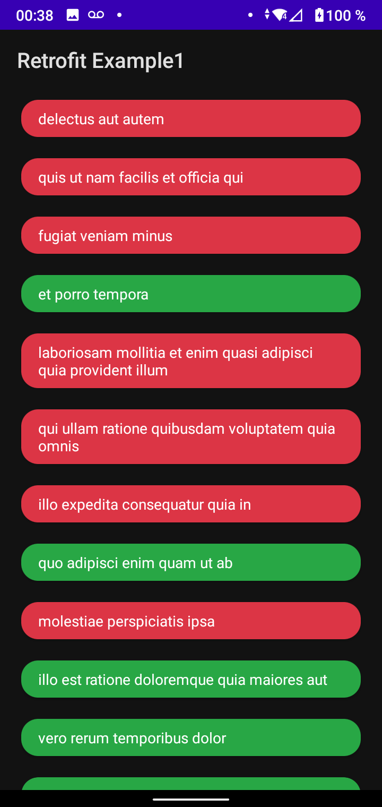

# Consumo de API REST con Retrofit

Esta aplicación consume la api de JsonPlaceholder de la lista de todos y la muestra en pantalla, diferenciando el fondo entre verde y rojo, dependiendo si la tarea esta realizada o no.

Elementos utilizados en la app:
* Retrofit y MoshiConverter
* ViewModel y LiveData
* RecyclerView
* ViewBinding

|                               Pantalla principal                               |
:------------------------------------------------------------------------------:
                                                                
|    